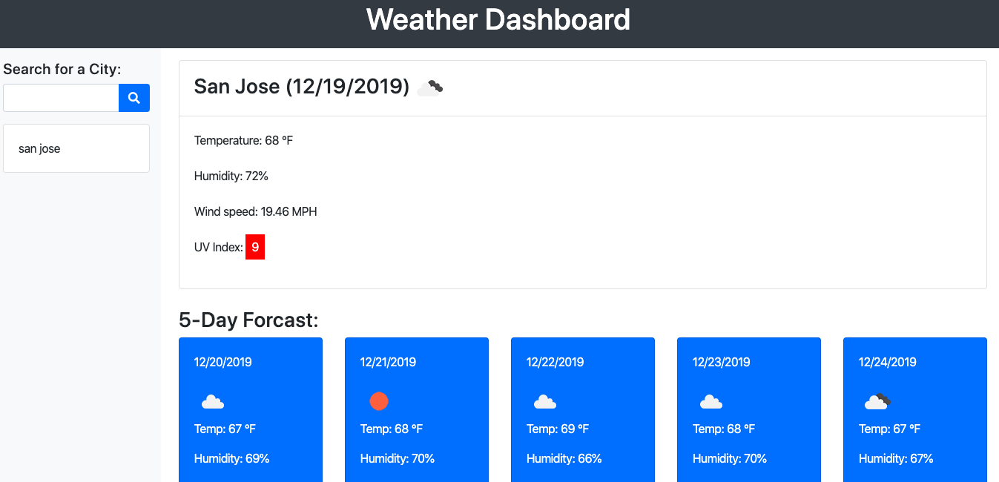

# weather-app

## Summary 
This project is used to indicate current weather condtions and also a 5 day forcast of searched cities. It utilizes bootstrap, jquery, and openWeatherMaps API. 

## Link to site
https://github.com/ken-Bains/weather-app

## Site Picture



## Technologies Used
- HTML - used to create elements on the DOM
- CSS - styles html elements on page
- Git - version control system to track changes to source code
- GitHub - hosts repository that can be deployed to GitHub Pages
- Bootstrap - front-end framework used to create modern websites and web apps.
- Jquery - jQuery is a JavaScript library designed to simplify building websites.
- OpenWeatherMap API - api used to gather weather conditions.

## Code Snippet
```javascript
    function getData(city) {
        var forcastUrl = "http://api.openweathermap.org/data/2.5/forecast?q=" + city + "&units=imperial&&appid=e3a10069efa8b8e0d1fbc786695520e8"
        var currentWeatherUrl = "http://api.openweathermap.org/data/2.5/weather?q=" + city + "&units=imperial&&appid=e3a10069efa8b8e0d1fbc786695520e8"

        $("#mainContentWrapper").removeClass("hideElement");
        $("#greetingText").addClass("hideElement");

        $.ajax({
            url: forcastUrl,
            method: "GET"
        }).then(function (res) {
            showForcast(res);
        });

        $.ajax({
            url: currentWeatherUrl,
            method: "GET"
        }).then(function (res) {
            showCurrentWeather(res);
            getUVIndex(res.coord);
        });
    };


```
- The code snippit above was used to gather information on weather conditions via a couple API calls.


## Author Links
[LinkedIn](https://www.linkedin.com/in/ken-bains)
[GitHub](https://github.com/ken-Bains)
